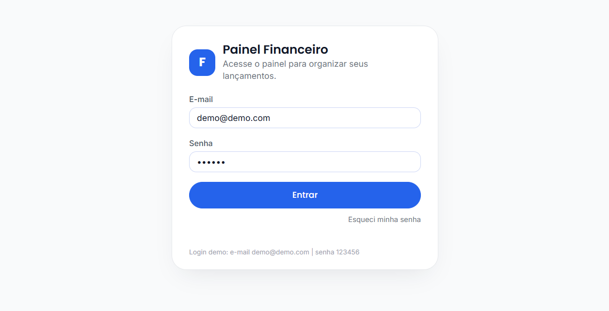
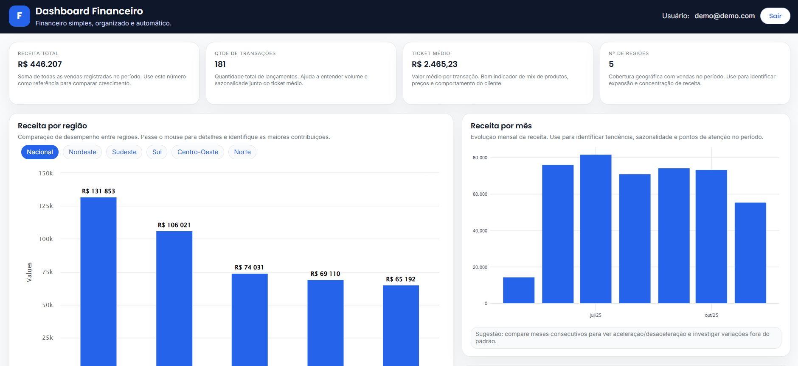
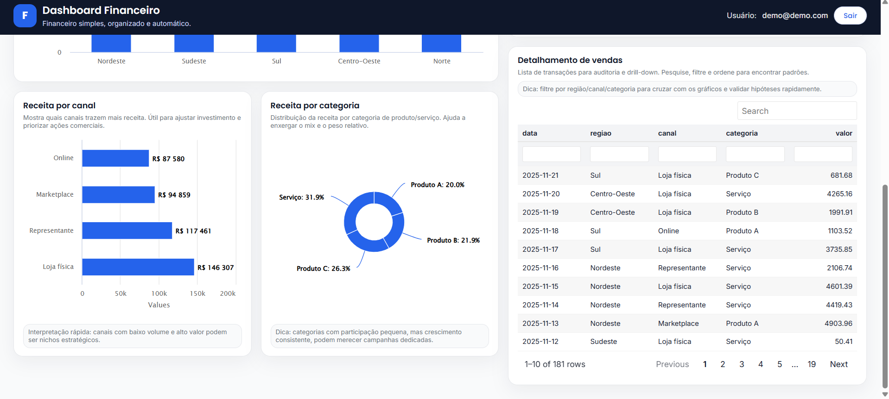

# Dashboards Shiny (básico) 📊

Projeto simples de **dashboard financeiro** em **R Shiny**, com uma tela de login demo e uma página principal com KPIs, gráficos e tabela.

## O que tem aqui

- 🔐 **Login demo** (credenciais fixas).
- **KPIs**: receita total, quantidade de transações, ticket médio e nº de regiões.
- **Gráficos**:
  - Receita por região (Highcharter)
  - Receita por canal (Highcharter)
  - Receita por categoria (donut, Highcharter)
  - Receita por mês (ggplot2)
- **Tabela detalhada** com busca/filtros (reactable).

## Prints





## Como rodar 🚀

1) Instale os pacotes (opcional, se ainda não tiver):

```r
source("packages.R")
```

2) Rode o app:

```r
shiny::runApp()
```

Ou abra o projeto no RStudio e execute `app.R`.

## Login demo

- E-mail: `demo@demo.com`
- Senha: `123456`

## Dados

Os dados do dashboard vêm de `data/dados_dashboard_demo.csv` (CSV local).  
Se quiser testar com outros dados, mantenha as colunas:

- `data` (date)
- `regiao` (character)
- `canal` (character)
- `categoria` (character)
- `valor` (double)

## Estrutura 🗂️

- `app.R`: ponto de entrada do Shiny (carrega módulos e CSS).
- `R/mod_login.R`: UI + server do login demo.
- `R/mod_dashboard.R`: UI + server do dashboard.
- `R/helpers_supabase.R`: helper do login demo (sem Supabase).
- `www/styles.css`: estilos do app.

## Observações

- O tema do `ggplot2` é aplicado se existir `R/helpers_theme.R` (já incluso no projeto).
- Este projeto é intencionalmente simples, focado em servir como base para evoluções.´

Testando o fluxo de branches e commits2.

